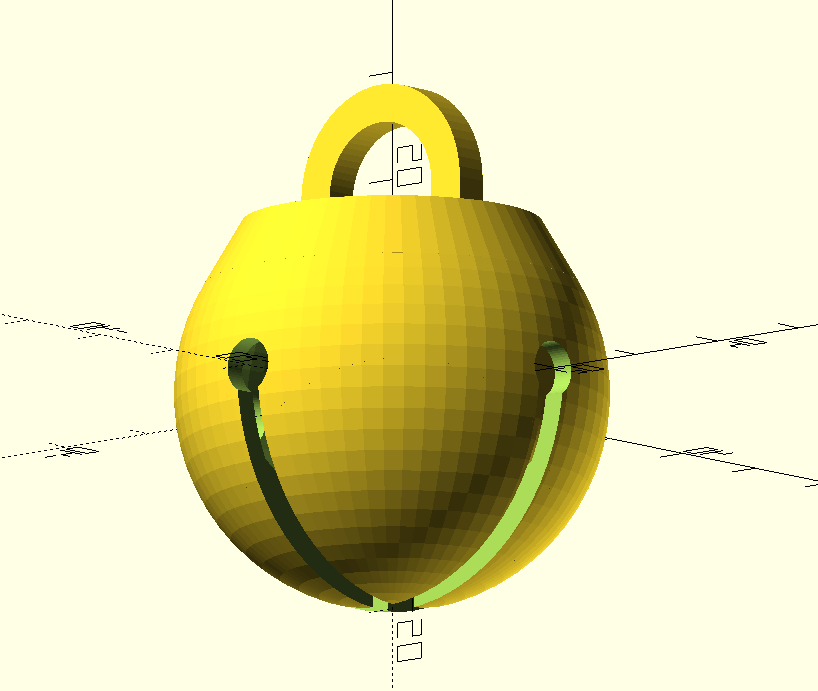

# 🎵 Jingle bell, jingle bell, jingle bell lock 🎵

This is my design for a padlock disguised as a jingle bell. Use it for fursuits, petplay, shibari—whatever strikes your fancy.

**This is a work in progress!** Please help me test and improve the design!

## How to use the OpenSCAD file

The OpenSCAD file relies on custom libraries, which are included in the /libraries/ folder. This entire folder should be moved to the OpenSCAD documents folder. For example, if your OpenSCAD documents folder is `~/Documents/OpenSCAD`, then the contents of the folder should go into `~/Documents/OpenSCAD/libraries`.

Parameters you can change are present at the top of the main file, `jinglebell.scad`.

## Printing and assembly

For FDM printers, you will probably want to start with the file `jinglebell_separated.stl`. This splits the part into six parts that should be easy to print and assemble. Support on the build plate is probably necessary.

The locking module is a (fairly) commonly available "stealth lock" popularized by chastity cages like the Holy Trainer. It can be found on eBay, AliExpress, and sometimes Amazon by searching "stealth lock" or "chastity stealth lock". I *think* the original is this ["keyhole blocker" (Model ME)](https://www.burg.biz/international/p/locks-and-bolts/e7me/) manufactured by Burg-Wächter. This is the only "professional" use I have seen for this lock module.