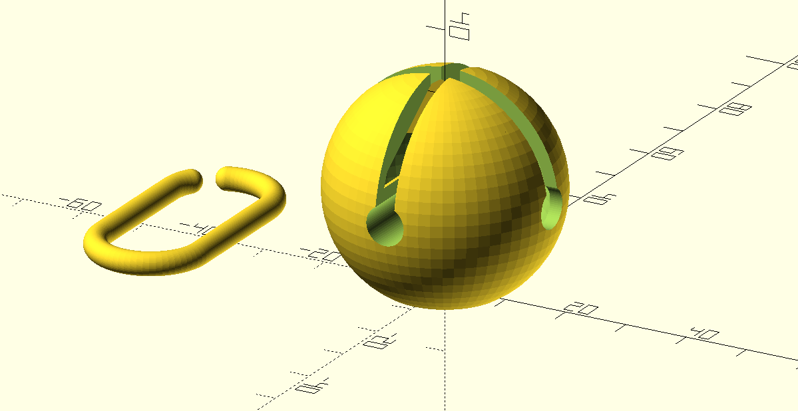

# 🎵 Jingle bell, jingle bell, jingle bell lock 🎵

This is my design for a padlock disguised as a jingle bell. Use it for fursuits, petplay, shibari—whatever strikes your fancy.

**This is a work in progress!** Please help me test and improve the design!

## How to use the OpenSCAD files

The main file is `jinglebell.scad`. The other three OpenSCAD files (`torus.scad`, `stealth_lock.scad`, and `handyfunctions.scad`) are custom libraries. You can put all four files in a single folder; however, I highly recommend putting the custom libraries in the /libraries/ subfolder inside the OpenSCAD documents folder. For example, if your OpenSCAD documents folder is `~/Documents/OpenSCAD`, then put the three custom libraries into `~/Documents/OpenSCAD/libraries`.

Parameters you can change are present at the top of the main file, `jinglebell.scad`.

## Printing and assembly

For FDM printers, you will probably want to start with the file `jinglebell_separated.stl`. This lays the parts out flat and renders the interior of the bell in an FDM-friendly way.

The locking module is a (fairly) commonly available "stealth lock" popularized by chastity cages like the Holy Trainer. It can be found on eBay, AliExpress, and sometimes Amazon by searching "stealth lock" or "chastity stealth lock". I *think* the original is this ["keyhole blocker" (Model ME)](https://www.burg.biz/international/p/locks-and-bolts/e7me/) manufactured by Burg-Wächter. This is the only "professional" use I have seen for this lock module.